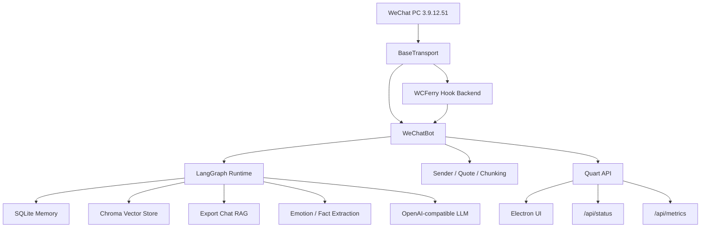

# WeChat Chat Bot

> **如果你觉得这个项目对你有帮助，请帮我点个 Star 吧！**
>
> 你的支持是我继续维护下去的动力 🙏

<div align="center">


⚡️ `WCFerry + Quart + Electron + LangChain/LangGraph` ⚡️ AI 助手
支持多 OpenAI-compatible 提供方、短期记忆、运行期 RAG、导出语料 RAG、情绪分析、Prompt 个性化和桌面/Web 控制台。
</div>

## Quick Manual

第一次使用建议按下面顺序执行，详细操作见使用手册：

1. [确认环境与限制](docs/USER_GUIDE.md#1-环境要求)
2. [安装 Python 依赖](docs/USER_GUIDE.md#2-安装依赖)
3. [安装桌面端依赖](docs/USER_GUIDE.md#2-安装依赖)
4. [配置模型与密钥](docs/USER_GUIDE.md#3-首次配置)
5. [执行环境自检](docs/USER_GUIDE.md#4-启动前检查)
6. [选择启动方式](docs/USER_GUIDE.md#5-启动方式)
7. [验证机器人是否工作](docs/USER_GUIDE.md#6-验证是否正常工作)
8. [启用 LangChain Runtime / RAG](docs/USER_GUIDE.md#7-langchain--rag-配置)
9. [排查常见问题](docs/USER_GUIDE.md#9-常见问题)

## Documentation

- [系统链路说明](docs/SYSTEM_CHAINS.md)
- [项目亮点与主链路](docs/HIGHLIGHTS.md)
- [详细使用手册](docs/USER_GUIDE.md)
- [配置说明](docs/USER_GUIDE.md#8-配置说明)
- [常见问题排查](docs/USER_GUIDE.md#9-常见问题)
- [开发与测试](docs/USER_GUIDE.md#10-开发与测试)

## Features

- `Multi-provider`: 支持 OpenAI、DeepSeek、Qwen、Doubao、Ollama、OpenRouter、Groq 等 OpenAI-compatible 接口。
- `LangGraph Runtime`: 用 LangChain/LangGraph 编排对话快路径；同步链只保留短期上下文和轻量画像注入，RAG、情绪、事实等高级能力统一后移到后台成长流水线。
- `Memory`: SQLite 持久化短期记忆、用户画像、上下文事实和情绪历史。
- `Contact Prompt Growth`: 每个联系人都可逐步沉淀一份专属 Prompt，支持后台生成、导出聊天增强和 UI 直接编辑。
- `RAG`: 支持运行期对话向量记忆、导出聊天记录风格召回，以及可选本地 `Cross-Encoder` 精排；未配置本地模型或缺依赖时自动回退轻量重排。
- `Transport Abstraction`: 传输层统一抽象为 `BaseTransport`，默认走 `wcferry`，并保证“接收消息 → 发送消息 → 完成落盘”的主闭环可独立演进。
- `Provider Compatibility`: 后端统一标准化请求字段、响应正文、工具调用、错误结构与落盘元数据，避免为单一提供方写定向分支。
- `Desktop + Web`: Electron 桌面客户端与 Quart Web API 并存。
- `Observability`: `/api/status` 提供启动进度、诊断、健康检查、系统指标以及成长链状态，`/api/metrics` 提供 Prometheus 风格导出。
- `Hot Reload`: 配置热重载优先使用 `watchdog` 事件监听，缺失依赖时自动回退轮询，并带防抖。
- `Config Snapshot`: 后端已引入中心化配置快照服务，`/api/config/audit` 可返回当前生效配置、已知未消费字段和配置变更影响摘要。

## Architecture



核心路径：

- 完整链路说明见 [系统链路说明](docs/SYSTEM_CHAINS.md)
- `backend/bot.py`: 机器人生命周期、消息入口和发送出口。
- `backend/core/agent_runtime.py`: LangChain/LangGraph 主运行时、对话快路径与后台成长任务。
- `backend/core/memory.py`: SQLite 记忆层。
- `backend/core/vector_memory.py`: Chroma 向量层。
- `backend/transports/`: 传输层抽象与具体后端。
- `backend/api.py`: Web API。
- `src/renderer/`: Electron 前端。

## Requirements

- Windows 10 / 11
- WeChat PC `3.9.12.51`
- Python `3.9+`
- Node.js `16+`

说明：

- 默认后端是 `wcferry`，目标是在后台收发时不抢焦点、不抢键鼠。
- `wcferry` 通过 WCFerry 注入微信进程，因此在 Windows 下必须以管理员权限运行本项目。
- 当前项目唯一官方支持的微信版本是 `3.9.12.51`。
- 旧版本微信下载链接：https://github.com/tom-snow/wechat-windows-versions/releases/tag/v3.9.12.51
- 当前需要将 `wcferry` 与微信 `3.9.12.51` 版本配套使用。
- `watchdog` 已纳入默认依赖，用于配置热重载事件监听。
- 如需启用本地 `Cross-Encoder` 精排，需要额外安装 `sentence-transformers`，并在配置中提供本地模型目录；项目不会自动联网下载模型。

限制：

- 不支持微信 `4.x`
- 不支持 Linux / macOS 直接运行微信自动化
- 运行期间需要保持微信客户端已登录且可被自动化访问

## Quick Start

```bash
git clone https://github.com/byteD-x/wechat-bot.git
cd wechat-bot
pip install -r requirements.txt
npm install
python run.py check
npm run dev
```

然后在桌面设置页中：

1. 选择模型预设
2. 填写 API Key
3. 测试连接
4. 保存配置
5. 启动机器人

补充说明：
- 使用 `Ollama` 时可以不填写 `API Key`，聊天模型与 embedding 模型可以分别配置。
- 向量记忆 / RAG 现在有独立总开关；首次开启时会提示本地存储、资源占用和潜在调用成本。
- 如需给向量记忆单独指定 embedding，可在“设置”页填写单独模型，或在预设里填写默认 embedding 模型；`Ollama` 可使用如 `nomic-embed-text` 之类的本地 embedding 模型。

完整配置流程见 [详细使用手册](docs/USER_GUIDE.md#3-首次配置)。

- 设置卡片标题旁会显示配置生效方式；“微信连接与传输”卡片保存后会自动重连传输层，其它卡片会标注为“保存后立即生效”或“仅机器人运行时即时生效”。
- 设置页支持“保存本模块”，便于只提交当前卡片的配置修改；消息页“消息详情”支持直接查看和编辑联系人画像摘要与专属 Prompt，日志页默认启用自动换行并按结构化阶段摘要展示重点事件。

## Run Modes

### Desktop Mode

```bash
npm run dev
```
或
```bash
dev.bat
```

适合通过 GUI 配置和观察运行状态。
桌面端启动后会自动轻启动 Python Web 服务，用于状态、消息、成本、日志等页面；机器人主循环和成长任务仍需手动启动。

### Headless Bot

```bash
python run.py start
```

适合完成配置后直接运行机器人主循环。

### Web API

```bash
python run.py web
```

适合单独运行后端控制接口或与外部工具集成。

## Configuration

主要配置分区：

- `api`: 模型、Base URL、API Key、预设、超时、重试、embedding 模型。
- `bot`: 回复策略、轮询、记忆、RAG、群聊规则、情绪识别、传输后端、配置热重载。
- `agent`: LangChain / LangGraph 运行时、检索参数、精排策略与 LangSmith 配置。
- `logging`: 日志级别、文件、轮转和内容开关。

配置运行机制：

- 运行期优先读取后端内存中的配置快照，而不是让各模块零散读取多个来源。
- 现在前后端统一以 `data/app_config.json` 作为唯一真实配置源；开发环境默认落在仓库 `data/`，安装包由 Electron 主进程通过 `WECHAT_BOT_DATA_DIR` 指向可写目录。
- 设置页会直接读写 `app_config.json`，支持自动保存、真实落盘、文件监听热更新，以及在未启动机器人时测试 AI 联通。
- Python Web API 仍保留 `/api/config` 与 `/api/config/audit` 兼容接口，但前端设置页不再依赖它们作为配置读写入口。

当前与本轮功能直接相关的关键配置：

```json
"bot": {
    "config_reload_mode": "auto",          # auto / polling / watchdog
    "config_reload_debounce_ms": 500,
    "allow_filehelper_self_message": True, # 允许文件传输助手中的自发消息参与回复
    "reply_deadline_sec": 2.0,             # 回复 deadline，优先争取 2 秒内给出真实回复
                                          # 设为 0 可关闭该 deadline，主链路将等待到 provider 自己的超时/重试结束
}

"agent": {
    "retriever_top_k": 3,
    "retriever_score_threshold": 1.0,
    "retriever_rerank_mode": "lightweight",  # lightweight / auto / cross_encoder
    "retriever_cross_encoder_model": "",     # 本地模型目录
    "retriever_cross_encoder_device": "",    # cpu / cuda
    "llm_foreground_max_concurrency": 1,
    "background_ai_batch_time": "04:00",
    "background_ai_missed_window_policy": "wait_until_next_day",
    "background_ai_defer_mode": "defer_all",
}
```

详细字段说明、覆盖优先级和修改方式见 [配置说明](docs/USER_GUIDE.md#8-配置说明)。

当前默认运行模式会把后台 AI 成长任务延后到凌晨批处理：
- 主回复独占前台 LLM 槽位，默认全局并发 `1`
- 白天产生的情绪分析、事实提取、联系人 prompt 刷新、运行期向量写入和导出 RAG 同步会进入持久化 backlog
- 每天本地时间 `04:00` 才会开始批处理；如果程序错过当天 `04:00`，会等下一次窗口，不做补跑

运行时输出目录约定：
- 应用日志默认写入 `data/logs/`
- 第三方运行时产物（如注入日志、锁文件）统一收口到 `data/runtime/`
- 测试缓存与覆盖率产物统一收口到 `data/runtime/test/`

## Development

```bash
# 安装依赖
pip install -r requirements.txt
npm install

# 桌面开发模式
npm run dev

# 启动机器人
python run.py start

# 启动 Web API
python run.py web

# 环境检查
python run.py check

# 语法检查
python -m py_compile backend\\core\\agent_runtime.py backend\\bot.py backend\\bot_manager.py backend\\api.py

# 重点测试
python -m pytest tests\\test_runtime_observability.py -q
```

## Release

Windows 正式发布现在默认只生成两种产物：

- `wechat-ai-assistant-setup-<version>.exe`
- `wechat-ai-assistant-portable-<version>-x64.exe`

补充说明：

- `MSI` 不再参与日常发版，只保留 `npm run build:msi` 作为按需构建入口
- 应用内自动更新已停用，桌面端只保留“打开 GitHub Releases 页面”的下载入口
- 正式 Release 通过 GitHub Actions 构建并上传，不再建议在本地直接上传大文件
- 每次 Release 的更新说明会自动基于“上一个正式 tag 到当前 tag”的 commit 区间生成

本地仅构建产物：

```bash
npm run build:release
```

或：

```bash
.\build.bat
```

## Cost Management

桌面端新增了独立的“成本管理”页面，用来查看 AI 回复的 token 与金额消耗。

- 支持按 `today / 7d / 30d / all` 筛选
- 支持按 `provider`、`model`、`仅已定价`、`是否包含估算数据` 过滤
- 按会话分组展示 AI 回复消耗，展开后可查看每条回复的模型、输入 token、输出 token、总 token、金额、时间和摘要
- 首页仪表盘新增“今日成本”卡片，并补充最近 30 天成本概览和高消耗模型入口

当前成本统计以 `chat_history` 中 assistant 消息的 `metadata` 为主数据源。新消息会在 metadata 中补充 `provider_id`、`pricing`、`cost`、`estimated`、`source_url`、`price_verified_at` 等字段；历史消息缺少 token 时会按文本长度估算，若能估 token 但无法可靠定价，则只展示 token 并标记为“待定价”。

### Cost APIs

新增接口如下：

- `GET /api/pricing`
- `POST /api/pricing/refresh`
- `GET /api/costs/summary`
- `GET /api/costs/sessions`
- `GET /api/costs/session_details`

说明：

- 金额按官方“每 1M tokens 单价”换算，不做汇率换算；混合币种会分币种展示
- `Ollama` 本地模型默认按 `0` 成本处理
- 自动刷新当前只覆盖较稳定来源：`DeepSeek`、`Groq`、`OpenRouter`
- `OpenAI`、`Qwen`、`Doubao` 首版以内置官方快照和手动覆盖为主

## Security

以下内容默认视为敏感数据：

- `API Key`
- `WECHAT_BOT_API_TOKEN`（如需手动调试 Web API，请自行设置并妥善保管；不要写入日志、不要截图外泄）
- `data/` 下的密钥与覆盖配置
- `data/chat_exports/`
- `data/logs/`
- 解密后的微信数据库

不要提交真实密钥、聊天导出和完整日志。

## License

MIT

## 配置精简

清理了一批早已废弃的配置项，减少干扰：
- `bot.memory_seed_*`、`bot.history_log_interval_sec`、`bot.poll_interval_sec`、`agent.history_strategy` 已从默认配置和 GUI 保存中移除。

## 成长任务管理

Dashboard 新增「成长任务」面板，现在可以按任务类型手动控制：

| 操作 | 说明 |
|------|------|
| 立即执行 | 立刻触发一次任务 |
| 暂停 / 恢复 | 中断或继续任务队列 |
| 清空队列 | 清掉所有待执行的任务 |

同时开放了对应的 API，方便集成：

```
GET  /api/growth/tasks
POST /api/growth/tasks/<task_type>/run
POST /api/growth/tasks/<task_type>/pause
POST /api/growth/tasks/<task_type>/resume
POST /api/growth/tasks/<task_type>/clear
```

## Windows 权限升级

 Release 安装包（`setup.exe` / `portable.exe`）现在默认带管理员权限清单，首次运行时会请求 UAC 提权，确保需要系统级操作的功能正常工作。
