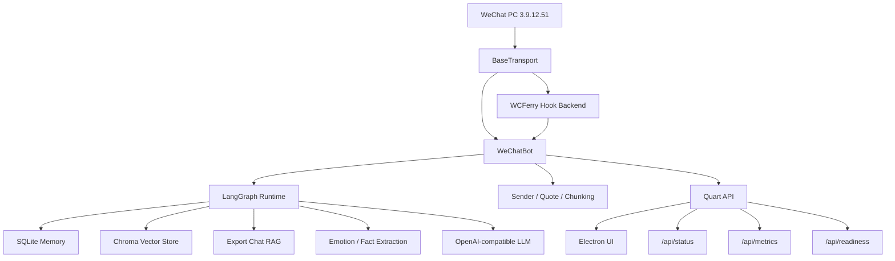

# WeChat Chat Bot

> **如果你觉得这个项目对你有帮助，请帮我点个 Star 吧！**
>
> 你的支持是我继续维护下去的动力 🙏

<div align="center">


⚡️ `WCFerry + Quart + Electron + LangChain/LangGraph` ⚡️ AI 助手
支持多 OpenAI-compatible 提供方、短期记忆、运行期 RAG、导出语料 RAG、情绪分析、Prompt 个性化和桌面/Web 控制台。
</div>

## Quick Manual

第一次使用建议按下面顺序执行，详细操作见使用手册：

1. [确认环境与限制](docs/USER_GUIDE.md#1-环境要求)
2. [安装 Python 依赖](docs/USER_GUIDE.md#2-安装依赖)
3. [安装桌面端依赖](docs/USER_GUIDE.md#2-安装依赖)
4. [配置模型与密钥](docs/USER_GUIDE.md#3-首次配置)
5. [执行环境自检](docs/USER_GUIDE.md#4-启动前检查)
6. [选择启动方式](docs/USER_GUIDE.md#5-启动方式)
7. [验证机器人是否工作](docs/USER_GUIDE.md#6-验证是否正常工作)
8. [启用 LangChain Runtime / RAG](docs/USER_GUIDE.md#7-langchain--rag-配置)
9. [排查常见问题](docs/USER_GUIDE.md#9-常见问题)

## Documentation

- [系统链路说明](docs/SYSTEM_CHAINS.md)
- [项目亮点与主链路](docs/HIGHLIGHTS.md)
- [详细使用手册](docs/USER_GUIDE.md)
- [配置说明](docs/USER_GUIDE.md#8-配置说明)
- [常见问题排查](docs/USER_GUIDE.md#9-常见问题)
- [开发与测试](docs/USER_GUIDE.md#10-开发与测试)

## Features

- `Model Auth Center`: 独立模型与认证中心，统一管理 `api_key / oauth / local_import / web_session`。只配置 `API Key` 或只配置 `OAuth / 本机同步` 都可以直接对话并使用完整功能；同时配置时默认优先 `OAuth / 本机同步`，也支持手动切换，当前认证不可用时会自动回退到同一服务商下的另一种可用认证。
- `Coding Plan Coverage`: 模型中心已补齐多条 Coding Plan 入口，当前可直接区分并配置 `Qwen / 百炼`、`Kimi Code`、`GLM Coding Plan`、`MiniMax Token Plan` 等订阅型 API Key，避免和同服务商的通用 API Key 混用。

- `Multi-provider`: 支持 OpenAI、DeepSeek、Qwen、Doubao、Ollama、OpenRouter、Groq 等 OpenAI-compatible 接口。
- `LangGraph Runtime`: 用 LangChain/LangGraph 编排对话快路径；同步链只保留短期上下文和轻量画像注入，RAG、情绪、事实等高级能力统一后移到后台成长流水线。
- `Memory`: SQLite 持久化短期记忆、用户画像、上下文事实和情绪历史。
- `Contact Prompt Growth`: 每个联系人都可逐步沉淀一份专属 Prompt，支持后台生成、导出聊天增强和 UI 直接编辑。
- `RAG`: 支持运行期对话向量记忆、导出聊天记录风格召回，以及可选本地 `Cross-Encoder` 精排；未配置本地模型或缺依赖时自动回退轻量重排。
- `Transport Abstraction`: 传输层统一抽象为 `BaseTransport`，默认走 `wcferry`，并保证“接收消息 → 发送消息 → 完成落盘”的主闭环可独立演进。
- `Provider Compatibility`: 后端统一标准化请求字段、响应正文、工具调用、错误结构与落盘元数据，避免为单一提供方写定向分支。
- `Desktop + Web`: Electron 桌面客户端与 Quart Web API 并存。
- `Observability`: `/api/status` 提供启动进度、诊断、健康检查、系统指标、回复质量、人工反馈与成长链状态，`/api/metrics` 提供 Prometheus 风格导出。
- `Readiness & Recovery`: `run.py check`、`GET /api/readiness` 与桌面端首次运行引导共用同一套环境检查逻辑；仪表盘会常驻显示“运行准备度”，并支持导出自动脱敏的诊断快照。
- `Hot Reload`: 配置热重载优先使用 `watchdog` 事件监听，缺失依赖时自动回退轮询，并带防抖。
- `Config Snapshot`: 后端已引入中心化配置快照服务，`/api/config/audit` 可返回当前生效配置、已知未消费字段和配置变更影响摘要。

## Architecture



核心路径：

- 完整链路说明见 [系统链路说明](docs/SYSTEM_CHAINS.md)
- `backend/bot.py`: 机器人生命周期、消息入口和发送出口。
- `backend/core/agent_runtime.py`: LangChain/LangGraph 主运行时、对话快路径与后台成长任务。
- `backend/core/memory.py`: SQLite 记忆层。
- `backend/core/vector_memory.py`: Chroma 向量层。
- `backend/transports/`: 传输层抽象与具体后端。
- `backend/api.py`: Web API。
- `src/renderer/`: Electron 前端。

## Requirements

- Windows 10 / 11
- WeChat PC `3.9.12.51`
- Python `3.9+`
- Node.js `16+`

说明：

- 默认后端是 `wcferry`，目标是在后台收发时不抢焦点、不抢键鼠。
- `wcferry` 通过 WCFerry 注入微信进程，因此在 Windows 下必须以管理员权限运行本项目。
- 当前项目唯一官方支持的微信版本是 `3.9.12.51`。
- 旧版本微信下载链接：https://github.com/tom-snow/wechat-windows-versions/releases/tag/v3.9.12.51
- 当前需要将 `wcferry` 与微信 `3.9.12.51` 版本配套使用。
- `watchdog` 已纳入默认依赖，用于配置热重载事件监听。
- 如需启用本地 `Cross-Encoder` 精排，需要额外安装 `sentence-transformers`，并在配置中提供本地模型目录；项目不会自动联网下载模型。

限制：

- 不支持微信 `4.x`
- 不支持 Linux / macOS 直接运行微信自动化
- 运行期间需要保持微信客户端已登录且可被自动化访问

## Quick Start

```bash
git clone https://github.com/byteD-x/wechat-bot.git
cd wechat-bot
pip install -r requirements.txt
npm install
python run.py check
python run.py check --json
npm run dev
```

首次打开桌面端时，应用会自动弹出“首次运行引导”，集中提示管理员权限、微信是否已启动、版本兼容和模型与认证是否就绪。

如果仍然无法启动，可以直接在仪表盘诊断区导出“诊断快照”；导出的 JSON 会自动脱敏，不会包含原始 API Key、token 或未脱敏配置。

然后在桌面端中按这个顺序完成：

1. 打开独立的“模型”页
2. 选择一个 Provider，并优先使用本机同步或 OAuth 登录
3. 如有需要，再补充 API Key / Session，作为备用认证
4. 测试连接；未手动指定时默认优先 OAuth，当前认证不可用时会自动回退到同一 Provider 下的另一种可用认证
5. 回到设置页确认只读摘要，然后启动机器人

补充说明：
- 使用 `Ollama` 时可以不填写 `API Key`，聊天模型与 embedding 模型可以分别配置。
- `OpenAI / Codex / ChatGPT` 与 `Google / Gemini / Gemini CLI` 已补齐纯 OAuth / 本机同步直连对话链路，不需要再额外补一个 `API Key` 才能开始对话。
- `Kimi / Moonshot / Kimi Code` 现在会把 `Moonshot API Key` 与 `Kimi Coding Plan API Key` 分开展示，并默认推荐 `kimi-for-coding`。
- `GLM / 智谱` 现在会把通用 `API Key` 与 `GLM Coding Plan API Key` 分开展示；当 `base_url` 指向 `https://open.bigmodel.cn/api/coding/paas/v4` 时会自动识别为智谱 Coding Plan。
- `MiniMax` 现在会把通用 `API Key` 与 `Token Plan API Key` 分开展示；国际区与中国区入口都支持，`https://api.minimaxi.com/v1` 以及 Anthropic-compatible 的 `/anthropic` 端点都会自动识别为 MiniMax。
- `百炼 / DashScope / bailian` 现在会统一归并到 `Qwen` Provider；即使在 `https://coding.dashscope.aliyuncs.com/v1` 上选择的是 `MiniMax / GLM / Kimi` 模型，仍会按百炼 Coding Plan 路径处理，不会被模型名误判到别的 Provider。
- 模型中心在首次配置 `Qwen OAuth / 百炼 Coding Plan`、`Kimi Code`、`GLM Coding Plan`、`MiniMax Token Plan` 这类专用方法时，会先预览并自动落到该方法推荐的 `base_url / model`，避免把 OAuth 或 Coding Plan 认证误投到通用对话端点。
- 遗留设置页里的 preset 序列化现在也会复用同一份 method metadata：旧配置即使仍按 `api_key / oauth` 保存，也会尽量写入对应 coding / OAuth runtime 的 `base_url / model / oauth_provider`，便于继续投影到真实对话链路。
- `Google / Gemini / Gemini CLI` 现在会在模型中心工作流里直接收集 `项目 ID`；如果本机 `Gemini CLI` 已经检测到可复用的 `project_id`，运行时会自动复用，不需要再手动补填一次。
- 对 `OpenAI / Codex / ChatGPT` 与 `Google / Gemini / Gemini CLI` 这类“浏览器打开后最终由本机凭据落盘完成”的方法，模型中心会在“继续完成授权”时优先走本机重扫，不会误要求用户补标准 OAuth callback。
- `Claude / Claude Code` 现在也有显式 `Claude Code OAuth` 方法；它和本机跟随共享同一组本地凭据探测与本机重扫收口，但实际进入 Anthropic 对话运行时仍要求 `apiKeyHelper` 或可复用的本机 API 凭据缓存。
- 向量记忆 / RAG 现在有独立总开关；首次开启时会提示本地存储、资源占用和潜在调用成本。
- 如需给向量记忆单独指定 embedding，可在“设置”页填写单独模型，或在预设里填写默认 embedding 模型；`Ollama` 可使用如 `nomic-embed-text` 之类的本地 embedding 模型。
- “系统提示”现在拆成“自定义系统提示词”与“固定注入块（只读）”；历史对话、用户画像、情绪/时间/风格等系统注入内容不会再暴露给设置页直接改写。
- 联系人专属 Prompt 与会话提示覆盖只需要填写自定义部分；即使用户没有手动带上历史/画像/情境占位块，运行时也会自动补齐这些系统必需注入项。

完整配置流程见 [详细使用手册](docs/USER_GUIDE.md#3-首次配置)。

- 设置卡片标题旁会显示配置生效方式；“微信连接与传输”卡片保存后会自动重连传输层，其它卡片会标注为“保存后立即生效”或“仅机器人运行时即时生效”。
- 设置页支持“保存本模块”，便于只提交当前卡片的配置修改；消息页“消息详情”支持直接查看联系人画像摘要，并把联系人专属 Prompt 拆成“自定义规则 + 固定注入块（只读）”两段编辑；日志页默认启用自动换行并按结构化阶段摘要展示重点事件。

## Run Modes

### Desktop Mode

```bash
npm run dev
```
或
```bash
dev.bat
```

适合通过 GUI 配置和观察运行状态。
桌面端启动后会自动轻启动 Python Web 服务，用于状态、消息、成本、日志等页面；机器人主循环和成长任务仍需手动启动。

### Headless Bot

```bash
python run.py start
```

适合完成配置后直接运行机器人主循环。

### Web API

```bash
python run.py web
```

适合单独运行后端控制接口或与外部工具集成。

## Configuration

主要配置分区：

- `api`: 模型、Base URL、API Key、预设、超时、重试、embedding 模型。
- `bot`: 回复策略、轮询、记忆、RAG、群聊规则、情绪识别、传输后端、配置热重载。
- `agent`: LangChain / LangGraph 运行时、检索参数、精排策略与 LangSmith 配置。
- `logging`: 日志级别、文件、轮转和内容开关。

配置运行机制：

- 运行期优先读取后端内存中的配置快照，而不是让各模块零散读取多个来源。
- 现在前后端统一以 `data/app_config.json` 作为唯一真实配置源；开发环境默认落在仓库 `data/`，安装包由 Electron 主进程通过 `WECHAT_BOT_DATA_DIR` 指向可写目录。
- 设置页会直接读写 `app_config.json`，支持自动保存、真实落盘、文件监听热更新，以及在未启动机器人时测试 AI 联通。
- Python Web API 仍保留 `/api/config` 与 `/api/config/audit` 兼容接口，但前端设置页不再依赖它们作为配置读写入口。

当前与本轮功能直接相关的关键配置：

```json
"bot": {
    "config_reload_mode": "auto",          # auto / polling / watchdog
    "config_reload_debounce_ms": 500,
    "allow_filehelper_self_message": True, # 允许文件传输助手中的自发消息参与回复
    "reply_deadline_sec": 2.0,             # 回复 deadline，优先争取 2 秒内给出真实回复
                                          # 设为 0 可关闭该 deadline，主链路将等待到 provider 自己的超时/重试结束
}

"agent": {
    "retriever_top_k": 3,
    "retriever_score_threshold": 1.0,
    "retriever_rerank_mode": "lightweight",  # lightweight / auto / cross_encoder
    "retriever_cross_encoder_model": "",     # 本地模型目录
    "retriever_cross_encoder_device": "",    # cpu / cuda
    "llm_foreground_max_concurrency": 1,
    "background_ai_batch_time": "04:00",
    "background_ai_missed_window_policy": "wait_until_next_day",
    "background_ai_defer_mode": "defer_all",
}
```

详细字段说明、覆盖优先级和修改方式见 [配置说明](docs/USER_GUIDE.md#8-配置说明)。

当前默认运行模式会把后台 AI 成长任务延后到凌晨批处理：
- 主回复独占前台 LLM 槽位，默认全局并发 `1`
- 白天产生的情绪分析、事实提取、联系人 prompt 刷新、运行期向量写入和导出 RAG 同步会进入持久化 backlog
- 每天本地时间 `04:00` 才会开始批处理；如果程序错过当天 `04:00`，会等下一次窗口，不做补跑

运行时输出目录约定：
- 应用日志默认写入 `data/logs/`
- 第三方运行时产物（如注入日志、锁文件）统一收口到 `data/runtime/`
- 测试缓存与覆盖率产物统一收口到 `data/runtime/test/`

## Stability-First Productization

This phase turns the project from a demo-style assistant into a safer personal product by adding three production-facing loops: reply approval, workspace recovery, and deterministic quality gates.

- `Reply Policy + Manual Approval`
  - Shared config now supports `bot.reply_policy.default_mode`, `new_contact_mode`, `group_mode`, `quiet_hours`, `sensitive_keywords`, `per_chat_overrides`, and `pending_ttl_hours`.
  - New contacts, non-whitelisted groups, quiet hours, sensitive keywords, or explicit manual mode can route replies into a persistent pending queue instead of sending immediately.
  - The dashboard and message detail panel now expose pending approvals, and each contact can override reply mode directly from the existing message detail entry.
- `Workspace Backup + Restore`
  - New backup APIs support `quick` and `full` snapshots, write `backup_manifest.json`, and keep restore flows conservative.
  - Destructive maintenance APIs now run under a shared maintenance lock to prevent concurrent restore/cleanup/data-clear races.
  - Restore now follows `dry-run -> checksum verification -> pre-restore quick backup -> stop runtime -> apply restore -> restart -> write result summary`, and returns post-restore auth warnings.
  - `quick` backup now includes `data/provider_credentials.json` to preserve provider-auth bindings across rollback.
  - `quick` backup also captures SQLite sidecar files (`chat_memory.db-wal` / `chat_memory.db-shm`) when present.
  - `full` backup includes both `data/chat_exports/` and `data/vector_db/` to keep retrieval memory consistent after restore.
  - Legacy backups without `checksum_summary` are treated as unverified and require explicit `allow_legacy_unverified=true` opt-in before restore apply.
  - `POST /api/backups` now requires bot/growth runtime to be stopped before creating snapshots; `POST /api/backups/restore` defaults to `dry_run=true` unless explicitly set to `false`.
  - Settings now include a dedicated "数据与恢复" card with recent backups, restore feedback, latest offline eval summary, and data-control cleanup (dry-run/apply with explicit scope and stopped runtime).
- `Offline Eval + CI Gates`
  - `python run.py eval --dataset <path> --preset <name> --report <path>` generates a deterministic JSON report with `summary`, `cases`, `regressions`, `generated_at`, `preset`, and `app_version`.
  - The smoke dataset lives at `tests/fixtures/evals/smoke_cases.json`.
  - CI now runs scoped `ruff`, targeted Python regressions, Node tests, and the offline eval smoke gate.

Key APIs introduced in this phase:

- `GET/POST /api/reply_policies`
- `GET /api/pending_replies`
- `POST /api/pending_replies/<id>/approve`
- `POST /api/pending_replies/<id>/reject`
- `GET /api/backups`
- `POST /api/backups`
- `POST /api/backups/cleanup`
- `POST /api/backups/restore`
- `GET /api/data_controls`
- `POST /api/data_controls/clear`
- `GET /api/evals/latest`

## Development

```bash
# 安装依赖
pip install -r requirements.txt
npm install

# 桌面开发模式
npm run dev

# 启动机器人
python run.py start

# 启动 Web API
python run.py web

# 环境检查
python run.py check
python run.py check --json

# 工作区备份
python run.py backup list --json
python run.py backup create --mode quick --label nightly
python run.py backup verify --backup-id <backup-id> --json
python run.py backup cleanup --keep-quick 5 --keep-full 3
python run.py backup cleanup --keep-quick 5 --keep-full 3 --apply
python run.py backup restore --backup-id <backup-id>
python run.py backup restore --backup-id <backup-id> --apply
python run.py backup restore --backup-id <backup-id> --apply --allow-running-service

# 语法检查
python -m py_compile backend\\core\\agent_runtime.py backend\\bot.py backend\\bot_manager.py backend\\api.py

# 重点测试
python -m pytest tests\\test_runtime_observability.py -q

# Scoped lint for the productization surface
python -m ruff check backend\\api.py backend\\bot.py backend\\bot_reply_flow.py backend\\config_schemas.py backend\\core\\memory.py backend\\core\\reply_policy.py backend\\core\\workspace_backup.py backend\\core\\eval_runner.py run.py tests\\test_api.py tests\\test_reply_policy.py tests\\test_backup_service.py tests\\test_eval_runner.py

# Offline eval smoke gate
python run.py eval --dataset tests\\fixtures\\evals\\smoke_cases.json --preset smoke --report data\\evals\\smoke-report.json
```

## Release

Windows 正式发布现在默认只生成两种产物：

- `wechat-ai-assistant-setup-<version>.exe`
- `wechat-ai-assistant-portable-<version>-x64.exe`

补充说明：

- `MSI` 不再参与日常发版，只保留 `npm run build:msi` 作为按需构建入口
- `setup.exe` 安装版已启用应用内自动更新：每次启动会检查 GitHub 最新 Release，发现新版本时弹窗展示版本号与更新说明，并支持“跳过此版本”或“下载更新”
- 下载完成后可在应用内直接执行“立即安装并重启”；安装流程会使用最新 `setup.exe` 覆盖升级现有安装目录
- `portable.exe` 仍保留手动更新模式，需前往 GitHub Releases 下载新版安装包
- 正式 Release 通过 GitHub Actions 构建并上传，不再建议在本地直接上传大文件
- 每次 Release 都必须提供 `docs/release_notes/<tag>.md`，并按 `Features / Improvements / Fixes / Performance / Breaking Changes` 的固定顺序编写；无内容分类直接省略
- Release 正文只写本次已发布且对外可感知的变化，默认面向普通用户描述，不再使用 commit/PR 风格流水账
- Release tag 必须使用 `vX.Y.Z`，`package.json` 版本号必须使用 `X.Y.Z`，且两者保持一致

本地仅构建产物：

```bash
npm run build:release
```

或：

```bash
.\build.bat
```

## Cost Management

消息页的列表、筛选摘要和消息详情现在会优先显示好友备注名或昵称；`chat_id` 仍用于内部检索和接口调用，但默认不再直接展示给用户。

桌面端新增了独立的“成本管理”页面，用来查看 AI 回复的 token 与金额消耗。
现在同一页面也会汇总“有帮助 / 没帮助”反馈分布，并提供“低质量回复复盘”列表，便于按会话回看没帮助回复的上下文摘要、检索增强摘要、复盘原因与建议动作。
成本页筛选现在额外支持按 `preset` 和 `review_reason` 缩小复盘范围，并可通过导出按钮获取当前筛选条件下的低质量回复复盘 JSON。
- 复盘列表顶部会额外汇总“优先处理建议”，把当前筛选结果按 `suggested_action` 聚合，便于先看最值得处理的方向。
- 点击“优先处理建议”里的动作项，会直接把成本页筛选切到对应 `suggested_action`。
- 导出的复盘 JSON 现在会为每个动作附带排查模板，包括建议先看的配置字段、状态项和检查步骤。
- 使用方式：先在“消息”页打开某条助手回复详情，标记“有帮助”或“没帮助”；再进入“成本管理”页查看反馈分布和“低质量回复复盘”。
- 进入复盘后，可先用 `preset`、`review_reason` 和“处理建议”筛选缩小范围；也可以直接点击“优先处理建议”里的动作项，自动切到对应动作筛选。
- 点击“导出复盘”时，导出内容只包含当前筛选结果；JSON 中每条记录会带 `suggested_action` 与 `action_guidance`，顶部 `playbook.actions` 会给出聚合后的优先动作与排查摘要。

- 支持按 `today / 7d / 30d / all` 筛选
- 支持按 `provider`、`model`、`preset`、`review_reason`、`仅已定价`、`是否包含估算数据` 过滤
- 按会话分组展示 AI 回复消耗，展开后可查看每条回复的模型、输入 token、输出 token、总 token、金额、时间和摘要
- 首页仪表盘新增“今日成本”卡片，并补充最近 30 天成本概览和高消耗模型入口

当前成本统计以 `chat_history` 中 assistant 消息的 `metadata` 为主数据源。新消息会在 metadata 中补充 `provider_id`、`pricing`、`cost`、`estimated`、`source_url`、`price_verified_at` 等字段；历史消息缺少 token 时会按文本长度估算，若能估 token 但无法可靠定价，则只展示 token 并标记为“待定价”。

### Cost APIs

新增接口如下：

- `GET /api/pricing`
- `POST /api/pricing/refresh`
- `GET /api/costs/summary`
- `GET /api/costs/sessions`
- `GET /api/costs/session_details`

说明：

- 金额按官方“每 1M tokens 单价”换算，不做汇率换算；混合币种会分币种展示
- `Ollama` 本地模型默认按 `0` 成本处理
- 自动刷新当前只覆盖较稳定来源：`DeepSeek`、`Groq`、`OpenRouter`
- `OpenAI`、`Qwen`、`Doubao` 首版以内置官方快照和手动覆盖为主

## Security

以下内容默认视为敏感数据：

- `API Key`
- `WECHAT_BOT_API_TOKEN`（如需手动调试 Web API，请自行设置并妥善保管；`/api/*` 请求可使用 `X-Api-Token` 或 `Authorization: Bearer <token>`；不要写入日志、不要截图外泄）
- `WECHAT_BOT_SSE_TICKET`（SSE 专用票据；`/api/events` 需携带 `?ticket=<ticket>`，可通过 `/api/events_ticket` 获取）
- `python run.py backup restore --apply` 默认会在检测到本地运行服务仍在运行时硬阻断；仅在明确知晓风险时使用 `--allow-running-service`
- `/api/model_auth/*` 与 `/api/auth/providers*` 返回中的本地路径字段会自动脱敏（仅保留文件名，且不返回 `watch_paths`）
- `/api/ollama/models` 仅允许本地回环地址（`localhost/127.0.0.1/::1`）作为 `base_url`，避免被误用为外部探测入口
- `/api/logs` 与 `/api/logs/clear` 会校验日志路径必须位于 `data` 目录，且日志读取有最大行数上限
- `data/` 下的密钥与覆盖配置
- `data/chat_exports/`
- `data/logs/`
- 解密后的微信数据库

不要提交真实密钥、聊天导出和完整日志。

## License

MIT

## 配置精简

清理了一批早已废弃的配置项，减少干扰：
- `bot.memory_seed_*`、`bot.history_log_interval_sec`、`bot.poll_interval_sec`、`agent.history_strategy` 已从默认配置和 GUI 保存中移除。

## 成长任务管理

Dashboard 新增「成长任务」面板，现在可以按任务类型手动控制：

| 操作 | 说明 |
|------|------|
| 立即执行 | 立刻触发一次任务 |
| 暂停 / 恢复 | 中断或继续任务队列 |
| 清空队列 | 清掉所有待执行的任务 |

同时开放了对应的 API，方便集成：

```
GET  /api/growth/tasks
POST /api/growth/tasks/<task_type>/run
POST /api/growth/tasks/<task_type>/pause
POST /api/growth/tasks/<task_type>/resume
POST /api/growth/tasks/<task_type>/clear
```

## Windows 权限升级

 Release 安装包（`setup.exe` / `portable.exe`）现在默认带管理员权限清单，首次运行时会请求 UAC 提权，确保需要系统级操作的功能正常工作。

## Self-Heal Update

- 如果“运行准备度”提示缺少管理员权限，桌面端现在可以直接执行“以管理员身份重新启动”，会通过 UAC 重新拉起应用，而不是只提示手动重开。
- 仪表盘“运行诊断”的恢复按钮现在会优先处理启动前阻塞项：例如先提权重启、先打开微信、或引导到设置页；只有没有 readiness 阻塞项时，才回退到运行态 `/api/recover`。
- `run.py check` 在管理员权限不足时也会给出新的排障提示，明确告诉用户可以直接在桌面端使用管理员重启。
## Model And Auth Center Update

- [Model Auth Center](docs/MODEL_AUTH_CENTER.md)

- 桌面端新增独立的“模型”页，原来设置页里的 API 预设已经拆出去；设置页现在只保留机器人、提示词、日志、备份等通用配置，并展示当前生效模型的只读摘要。
- 每个 Provider 现在可以并存多种认证方法，模型中心会为每个 Provider 维护一组 `auth_profiles`，并显式选择默认认证方式；运行时只投影当前选中的那一条到 `api.presets`。
- 模型卡片会按 `当前激活 -> 认证可用 -> 检测到本机登录但未绑定 -> 未配置` 排序，并通过不同状态样式区分 `当前生效 / OAuth 可用 / API Key 可用 / 待授权 / 实验能力`。
- 每张 Provider 卡片现在还会展示后端聚合出来的 `本机同步摘要 / 健康检查摘要 / 认证计数`，前端不再自己拼装这些高层状态。
- 已绑定的认证方法现在会显式标出 `运行时可用 / 运行时未就绪`；如果默认认证还不能进入运行时，请求摘要会直接展示阻塞原因，而不是只给一个模糊失败态。
- 新增模型与认证中心接口：
  - `GET /api/model_auth/overview`
  - `POST /api/model_auth/action`
  - 旧的 `/api/auth/providers/*` 只剩兼容壳层，不再由设置页、旧预设 modal 或模型页主流程直接调用；前端统一走模型中心接口
- 当前 Provider 策略：
  - 已接入核心能力：`OpenAI / Codex / ChatGPT`、`Google / Gemini / Gemini CLI`、`Qwen / DashScope / Qwen Code`、`Claude / Claude Code`、`Kimi / Moonshot / Kimi Code`、`GLM / 智谱`、`MiniMax`、`Doubao / 火山方舟 / TRAE`、`Yuanbao / 元宝`
  - 扩展预留：`DeepSeek`
  - `Qwen` 现在会把 `DashScope API Key` 与 `Coding Plan API Key` 拆成两条独立认证方法，而不是继续共用一张泛化 API Key 表单
  - `bailian / dashscope` 这类外部配置里的 Provider ID 现在会自动规范成 `qwen`，百炼 Coding Plan 上承载的 `MiniMax / GLM / Kimi` 模型也会继续落在同一条百炼配置链路
  - `Claude / Claude Code` 现已补齐独立 `Claude Code OAuth` 与 `Claude Code 本机登录` 双入口，允许把浏览器登录和本机凭据跟随分开配置
  - `Kimi / Kimi Code` 现已补齐独立 `Kimi Coding Plan API Key`，并把 `kimi-for-coding` 作为 Coding 场景默认模型
  - `GLM / 智谱` 现已补齐独立 `GLM Coding Plan API Key`，并支持按 Coding Plan base URL 自动识别 Provider
  - `MiniMax` 现已补齐独立 `Token Plan API Key`，并支持按地区识别 `api.minimax.io / api.minimaxi.com`
  - `Doubao / Yuanbao` 的网页登录当前按 `web_session` 建模，不伪装成标准 OAuth
- `Claude / Claude Code` 当前已接入 `~/.claude.json` / `~/.claude/settings.json` / `~/.claude/.credentials.json` / `C:/ProgramData/ClaudeCode/managed-settings.json` 的本地发现；当本地存在 `apiKeyHelper` 或可复用的 Claude API 凭据缓存时，会直接走 `anthropic_native` 运行时链路。`Kimi / Kimi Code` 已接入 `~/.kimi/config.toml` / `~/.kimi/credentials/*.json` 的本地发现。
- `Claude / Claude Code` 的 helper / 本地 credential cache 进入运行时后，如果首次调用命中 `401`，当前会先强制刷新一次本地认证再自动重试，减少本地凭据刚轮换时的瞬时失败。
- `Claude / Claude Code` 现在新增 `Claude Vertex AI 本机认证`：会复用 `gcloud` 的 `application_default_credentials.json` 或 `GOOGLE_APPLICATION_CREDENTIALS`，运行时直接走 Vertex AI 的 `publishers/anthropic/models/{model}:rawPredict` 链路，不再只停留在文档占位。
- 对 `Claude on Vertex AI`，项目会把 `claude-sonnet-4-0`、`claude-opus-4-1`、`claude-3-7-sonnet-latest` 这类 Anthropic 风格模型 ID 自动映射成 Vertex API 模型 ID；当前仍未实现 `Claude Bedrock` 的 SigV4 / Converse 运行时。
- `Doubao / Yuanbao` 当前会优先尝试检测本机浏览器 Cookie 数据库、`IndexedDB / Local Storage`、桌面私有存储或显式导出 Session 文件，再提示用户绑定或导入。
- 模型中心现在也会把 `system_keychain` 作为补充发现信号接入统一状态机；当前主要用于 Windows Credential Manager target 发现与跟随提示，不代表已经开放稳定运行时消费。
- 对支持本机授权复用的 Provider，项目不会把本地认证源复制为长期真源；运行时会按需读取本地标准授权位置或本地凭据缓存，因此本机认证变化后，项目中的实际认证也会跟着变化。
- `Kimi / Kimi Code` 的本地认证现在已经进入真实运行时链路：优先跟随 `~/.kimi/config.toml` 中由 `/login` 写入的 provider 配置，必要时再回退到 `~/.kimi/credentials/*.json` 的本地凭据缓存，因此默认不会再误投影到 Moonshot API Key 的 endpoint。
- 模型中心还会启动后台本机认证同步器：对已发现的本机认证文件或目录级存储目标优先走路径级 watcher，监听不可用时自动回退到 polling；手动“扫描本机认证”会触发强制刷新。
