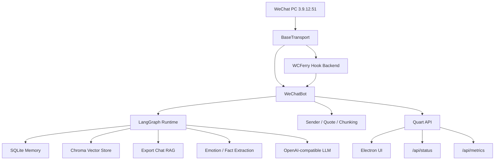

# WeChat Chat Bot

<div align="center">


基于 `WCFerry + wxauto(兼容模式) + Quart + Electron + LangChain/LangGraph` 的微信 AI 自动回复机器人。  
支持多 OpenAI-compatible 提供方、短期记忆、运行期 RAG、导出语料 RAG、情绪分析、Prompt 个性化和桌面/Web 控制台。
</div>

## Quick Manual

第一次使用建议按下面顺序执行，详细操作见使用手册：

1. [确认环境与限制](docs/USER_GUIDE.md#1-环境要求)
2. [安装 Python 依赖](docs/USER_GUIDE.md#2-安装依赖)
3. [安装桌面端依赖](docs/USER_GUIDE.md#2-安装依赖)
4. [配置模型与密钥](docs/USER_GUIDE.md#3-首次配置)
5. [执行环境自检](docs/USER_GUIDE.md#4-启动前检查)
6. [选择启动方式](docs/USER_GUIDE.md#5-启动方式)
7. [验证机器人是否工作](docs/USER_GUIDE.md#6-验证是否正常工作)
8. [启用 LangChain Runtime / RAG](docs/USER_GUIDE.md#7-langchain--rag-配置)
9. [排查常见问题](docs/USER_GUIDE.md#9-常见问题)

## Documentation

- [系统链路说明](docs/SYSTEM_CHAINS.md)
- [项目亮点与主链路](docs/HIGHLIGHTS.md)
- [详细使用手册](docs/USER_GUIDE.md)
- [配置说明](docs/USER_GUIDE.md#8-配置说明)
- [常见问题排查](docs/USER_GUIDE.md#9-常见问题)
- [开发与测试](docs/USER_GUIDE.md#10-开发与测试)

## Features

- `Multi-provider`: 支持 OpenAI、DeepSeek、Qwen、Doubao、Ollama、OpenRouter、Groq 等 OpenAI-compatible 接口。
- `LangGraph Runtime`: 用 LangChain/LangGraph 编排上下文加载、RAG、情绪分析、提示词构建、流式回复和后台事实提取。
- `Memory`: SQLite 持久化短期记忆、用户画像、上下文事实和情绪历史。
- `RAG`: 支持运行期对话向量记忆、导出聊天记录风格召回，以及可选本地 `Cross-Encoder` 精排；未配置本地模型或缺依赖时自动回退轻量重排。
- `Transport Abstraction`: 传输层统一抽象为 `BaseTransport`，默认走 `hook_wcferry`，为后续兼容实现预留扩展点。
- `Desktop + Web`: Electron 桌面客户端与 Quart Web API 并存。
- `Observability`: `/api/status` 提供启动进度、诊断、健康检查和系统指标，`/api/metrics` 提供 Prometheus 风格导出。
- `Hot Reload`: 配置热重载优先使用 `watchdog` 事件监听，缺失依赖时自动回退轮询，并带防抖。
- `Config Snapshot`: 后端已引入中心化配置快照服务，`/api/config/audit` 可返回当前生效配置、已知未消费字段和配置变更影响摘要。

## Architecture



核心路径：

- 完整链路说明见 [系统链路说明](docs/SYSTEM_CHAINS.md)
- `backend/bot.py`: 机器人生命周期、消息入口和发送出口。
- `backend/core/agent_runtime.py`: LangChain/LangGraph 主运行时、RAG 召回与精排。
- `backend/core/memory.py`: SQLite 记忆层。
- `backend/core/vector_memory.py`: Chroma 向量层。
- `backend/transports/`: 传输层抽象与具体后端。
- `backend/api.py`: Web API。
- `src/renderer/`: Electron 前端。

## Requirements

- Windows 10 / 11
- WeChat PC `3.9.12.51`
- Python `3.9+`
- Node.js `16+`

说明：

- 默认后端是 `hook_wcferry`，目标是在后台收发时不抢焦点、不抢键鼠。
- `hook_wcferry` 通过 WCFerry 注入微信进程，因此在 Windows 下必须以管理员权限运行本项目。
- 当前项目唯一官方支持的微信版本是 `3.9.12.51`。
- 旧版本微信下载链接：https://github.com/tom-snow/wechat-windows-versions/releases/tag/v3.9.12.51
- 当前需要将 `hook_wcferry` 与微信 `3.9.12.51` 版本配套使用。
- `watchdog` 已纳入默认依赖，用于配置热重载事件监听。
- 如需启用本地 `Cross-Encoder` 精排，需要额外安装 `sentence-transformers`，并在配置中提供本地模型目录；项目不会自动联网下载模型。

限制：

- 不支持微信 `4.x`
- 不支持 Linux / macOS 直接运行微信自动化
- 运行期间需要保持微信客户端已登录且可被自动化访问

## Quick Start

```bash
git clone https://github.com/byteD-x/wechat-bot.git
cd wechat-bot
pip install -r requirements.txt
npm install
python run.py check
npm run dev
```

然后在桌面设置页中：

1. 选择模型预设
2. 填写 API Key
3. 测试连接
4. 保存配置
5. 启动机器人

补充说明：
- 使用 `Ollama` 时可以不填写 `API Key`，聊天模型与 embedding 模型可以分别配置。
- 向量记忆 / RAG 现在有独立总开关；首次开启时会提示本地存储、资源占用和潜在调用成本。
- 如需给向量记忆单独指定 embedding，可在“设置”页填写单独模型，或在预设里填写默认 embedding 模型；`Ollama` 可使用如 `nomic-embed-text` 之类的本地 embedding 模型。

完整配置流程见 [详细使用手册](docs/USER_GUIDE.md#3-首次配置)。

- 设置卡片标题旁会显示配置生效方式；“微信连接与传输”卡片保存后会自动重连传输层，其它卡片会标注为“保存后立即生效”或“仅机器人运行时即时生效”。

## Run Modes

### Desktop Mode

```bash
npm run dev
```

适合通过 GUI 配置和观察运行状态。

### Headless Bot

```bash
python run.py start
```

适合完成配置后直接运行机器人主循环。

### Web API

```bash
python run.py web
```

适合单独运行后端控制接口或与外部工具集成。

## Configuration

主要配置分区：

- `api`: 模型、Base URL、API Key、预设、超时、重试、embedding 模型。
- `bot`: 回复策略、轮询、记忆、RAG、群聊规则、情绪识别、传输后端、配置热重载。
- `agent`: LangChain / LangGraph 运行时、检索参数、精排策略、流式回复与 LangSmith 配置。
- `logging`: 日志级别、文件、轮转和内容开关。

配置运行机制：

- 运行期优先读取后端内存中的配置快照，而不是让各模块零散读取多个来源。
- GUI 保存配置后，`/api/config` 会返回 `changed_paths` 和 `reload_plan`，用于说明哪些字段变了、预计如何生效。
- 可通过 `/api/config/audit` 查看当前生效配置中的已知未消费字段、未知 override 字段和生效策略摘要。

当前与本轮功能直接相关的关键配置：

```python
"bot": {
    "config_reload_mode": "auto",          # auto / polling / watchdog
    "config_reload_debounce_ms": 500,
}

"agent": {
    "retriever_top_k": 3,
    "retriever_score_threshold": 1.0,
    "retriever_rerank_mode": "lightweight",  # lightweight / auto / cross_encoder
    "retriever_cross_encoder_model": "",     # 本地模型目录
    "retriever_cross_encoder_device": "",    # cpu / cuda
}
```

详细字段说明、覆盖优先级和修改方式见 [配置说明](docs/USER_GUIDE.md#8-配置说明)。

运行时输出目录约定：
- 应用日志默认写入 `data/logs/`
- 第三方运行时产物（如注入日志、锁文件）统一收口到 `data/runtime/`
- 测试缓存与覆盖率产物统一收口到 `data/runtime/test/`

## Development

```bash
# 安装依赖
pip install -r requirements.txt
npm install

# 桌面开发模式
npm run dev

# 启动机器人
python run.py start

# 启动 Web API
python run.py web

# 环境检查
python run.py check

# 语法检查
python -m py_compile backend\\core\\agent_runtime.py backend\\bot.py backend\\bot_manager.py backend\\api.py

# 重点测试
python -m pytest tests\\test_runtime_observability.py -q
```

## Security

以下内容默认视为敏感数据：

- `API Key`
- `WECHAT_BOT_API_TOKEN`（如需手动调试 Web API，请自行设置并妥善保管；不要写入日志、不要截图外泄）
- `data/` 下的密钥与覆盖配置
- `data/chat_exports/`
- `data/logs/`
- 解密后的微信数据库

不要提交真实密钥、聊天导出和完整日志。

## License

MIT

## Legacy Config Cleanup

- Removed from defaults and GUI saves: `bot.memory_seed_*`, `bot.history_log_interval_sec`, `bot.poll_interval_sec`, `agent.history_strategy`.
