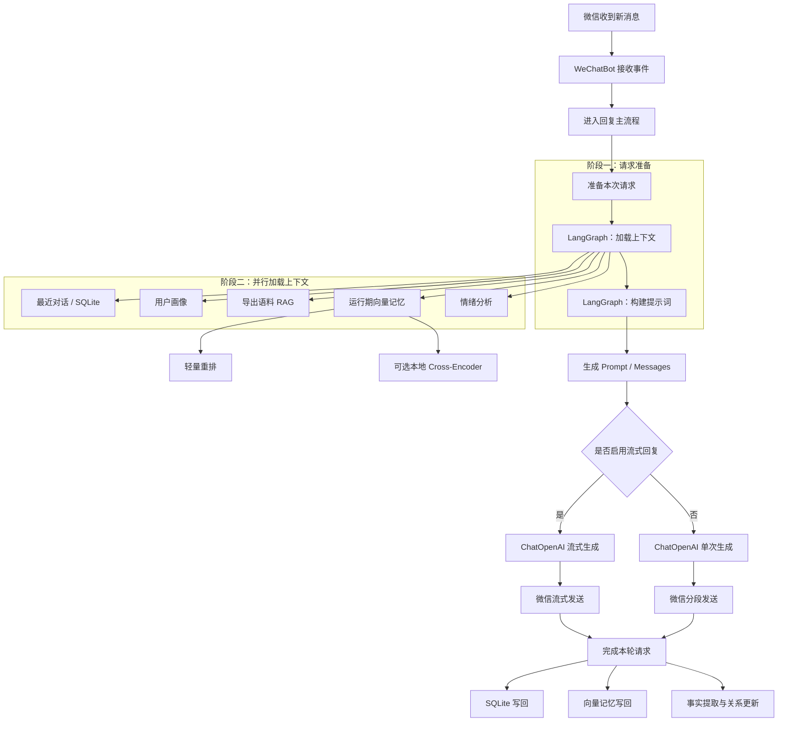

# 项目亮点

这份文档用于集中展示当前项目的技术亮点，以及已经落地的 LangChain/LangGraph 主链路。

如需查看覆盖 Electron、Quart API、Bot 生命周期、传输层、语音转文字、记忆/RAG、回复发送、配置热更新和状态诊断的完整链路，请参考 [SYSTEM_CHAINS.md](SYSTEM_CHAINS.md)。

## 1. 当前阶段的核心亮点

### 1.1 微信自动化 + 现代 AI 编排

项目不是简单地“收到消息后直接请求模型”，而是把微信自动化、上下文记忆、RAG、情绪分析、事实提取、流式输出整合成一条统一运行链。

核心特征：

- 微信消息入口已抽象为 `BaseTransport`，默认主链路为 `hook_wcferry`
- Web 控制面基于 `Quart`
- 桌面控制台基于 `Electron`
- AI 编排主链路基于 `LangChain + LangGraph`
- 官方支持的微信版本基线统一为 `3.9.12.51`

### 1.2 多模型提供方统一接入

当前运行时并不绑定单一厂商，而是统一支持 OpenAI-compatible 提供方，例如：

- OpenAI
- DeepSeek
- Qwen
- Doubao
- Ollama
- OpenRouter
- Groq

这意味着项目在保留供应商灵活性的同时，仍然可以复用统一的提示词、RAG 和运行时编排。

同时，`Ollama` 现在不仅可作为聊天模型提供方，也可以直接承担本地 embedding 能力，支持在预设或设置页为向量记忆单独指定 embedding 模型。

### 1.3 记忆系统是分层设计

项目当前已经形成三层记忆：

1. 短期记忆：SQLite 最近对话上下文
2. 运行期向量记忆：当前聊天的语义召回
3. 导出语料 RAG：历史真实聊天风格召回

其中运行期 RAG 已经具备两级精排能力：

- 默认轻量重排：向量距离 + 关键词重合
- 可选本地 `Cross-Encoder`：仅在本地模型目录和依赖可用时启用，否则自动回退

在产品层面，向量记忆 / RAG 已增加独立总开关和首次开启风险提示，把“能力可用”与“用户确认存储/成本影响”分开，降低误开后的理解成本。

### 1.4 LangGraph 不是 SDK 替换，而是运行时重构

这次集成不是把 HTTP 请求改成 `ChatOpenAI()` 就结束，而是把主处理流程拆成：

- 可编排的上下文准备图
- 可复用的模型与 embedding 适配
- 可流式输出的回复生成
- 可后台执行的事实提取和向量写回
- 可观察的 runtime 指标与 tracing

### 1.5 可观测性和运行反馈已落地

当前链路已经具备：

- `/api/status` 结构化返回启动进度、诊断、健康检查和系统指标
- `/api/metrics` 提供 Prometheus 风格导出
- Electron 仪表盘展示 CPU、内存、队列积压、AI 延迟和组件健康状态
- 配置热重载优先使用 `watchdog`，缺失依赖时回退轮询，并带防抖
- 后端新增中心化 Config Snapshot，GUI 保存配置后会返回 `changed_paths` 与 `reload_plan`，并可通过 `/api/config/audit` 排查未生效或未知配置项。

### 1.6 面向性能的实现细节已经落地

当前链路已经包含这些性能优化点：

- Chat 会话级锁，避免同一会话并发写乱上下文
- Embedding 请求缓存与 pending 去重
- 上下文加载阶段并发执行短期记忆 / RAG / 情绪分析
- `MemoryManager.get_recent_context_batch()` 批量读取多会话上下文
- `AIClient` 共享 `httpx.AsyncClient` 连接池并使用引用计数回收
- 非关键后台任务异步化，不阻塞首响应

## 2. 当前 LangChain / LangGraph 链路

### 2.1 总体链路图

### 2.2 关键节点与职责

#### `load_context`

- 读取 SQLite 最近上下文
- 读取用户画像
- 触发消息计数增长
- 召回导出语料 RAG
- 召回运行期向量记忆
- 分析情绪

#### `build_prompt`

- 调用 `resolve_system_prompt()`
- 合并系统提示、画像、情绪、RAG 结果、历史上下文
- 构建 LangChain message 列表

#### `invoke / stream_reply`

- 统一通过 `ChatOpenAI` 调用 OpenAI-compatible 模型
- 支持 `max_tokens`、`max_completion_tokens` 和 `reasoning_effort`

#### `finalize_request`

- 将本轮 user / assistant 消息写回 SQLite
- 写回情绪状态
- 异步写回向量记忆
- 异步做事实提取和关系更新

## 3. 当前链路的并发、降级与观测设计

### 3.1 首响应优先

当前设计目标不是追求“最复杂的 agent”，而是优先缩短用户体感延迟。

做法：

- `load_context` 阶段并发取记忆、RAG、情绪
- 流式回复优先发出首个 chunk
- 事实提取和向量写回放到后台

### 3.2 失败降级

当前链路不是单点失败即整体失败。

降级策略：

- 导出语料 RAG 失败：忽略该部分上下文
- 运行期向量检索失败：忽略该部分上下文
- `Cross-Encoder` 精排失败：回退轻量重排
- 情绪分析失败：回退关键词分析或不注入情绪
- LangSmith 失败：不影响主回复

### 3.3 运行可观测性

当前已经具备：

- `startup` 启动进度
- `diagnostics` 结构化故障诊断
- `health_checks` 组件级健康状态
- `system_metrics` CPU / 内存 / 队列 / AI 延迟
- `/api/metrics` 指标导出

## 4. 对外展示时可强调的点

如需对外介绍这个项目，当前最值得强调的是：

- 不是普通的微信自动回复，而是有完整记忆与 RAG 分层的本地 agent
- 不是绑定单模型厂商，而是兼容 OpenAI-compatible 生态
- 不是只接 LangChain SDK，而是把 LangGraph 真正放进主运行时
- 不是只有召回，还做了轻量重排和可选本地 `Cross-Encoder` 精排
- 不是黑盒运行，而是具备健康检查、启动进度和 Prometheus 风格指标导出
